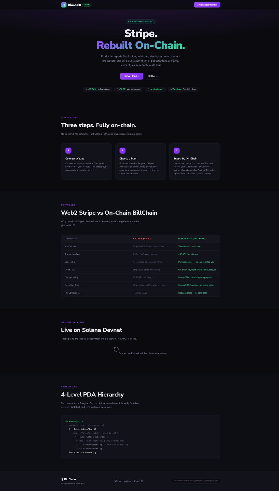

# On-Chain Subscription Billing System
### Anchor · Solana Devnet · Rust · TypeScript

> **A production-grade SaaS billing engine running entirely on-chain** — no databases, no payment processors, no trust assumptions. Think Stripe, but trustless and composable.

---

## 🔗 Live Devnet Deployment

| | |
|---|---|
| **Program ID** | `CHiGNDhvm7KCL3216YqajQMf82h2HUJo9hTPgksbGCZB` |
| **Network** | Solana Devnet |
| **Deployer** | `CF9qQdfCJRPVkGTK4F2vMG1uFGmdPom9ZrYKAakHQB73` |
| **Deploy TX** | [222zyEjd...](https://explorer.solana.com/tx/222zyEjd7E56BU9KjhT6y12mYqgkSJQHsQf1ExGu7Q5gydzhqrLwvL8bMmj5QfqmJwrcZGs7VW6f8jGsj7W2AL29?cluster=devnet) |
| **Upgrade TX** | [4wWRQnhJ...](https://explorer.solana.com/tx/4wWRQnhJ3Mv5M36yZzSFVCKfToaTMjtE146oyuRWxu9A7Xj9ZJ78moVW2PnAbgzFK6weaNzyKhgr9f9L37DyqMYn?cluster=devnet) |
| **Explorer** | [View on Solana Explorer](https://explorer.solana.com/address/CHiGNDhvm7KCL3216YqajQMf82h2HUJo9hTPgksbGCZB?cluster=devnet) |
| **Live dApp** | [posgame3.github.io/subscription-billing](https://posgame3.github.io/subscription-billing/) |

### 🎬 Live Demo Transactions (verified on devnet)

| Instruction | Transaction |
|---|---|
| `create_plan` | [42we73fb...](https://explorer.solana.com/tx/42we73fbgLWKuzpHPzRG3r66b494FGn32jiANPKJ8BXMaGG72rDTATxjRaHsLWyvh74rA6B15cBiCzBm6vmj7qiq?cluster=devnet) |
| `subscribe` | [2Ypocw2a...](https://explorer.solana.com/tx/2Ypocw2a4CtgwqWvfZuhGFQsv5j5B9eNJ23digWHp28NshgtCBz7sdJ6Z3vFw5shXnJRFCuzYndKb36qQ4kjXbpp?cluster=devnet) |
| `renew` | [3M6ospCZ...](https://explorer.solana.com/tx/3M6ospCZpAopfUNt3YgpBZmQqzFGgVQ9Fz5arf3FKhskMxJdaRzFiQPfz79u5g8hygMtr9taiXbsned34X4c54z5?cluster=devnet) |
| `cancel` | [51DRSwyP...](https://explorer.solana.com/tx/51DRSwyPwe9AG74AyVnpoQq4qD5SPn6pJ22K8mGc5eprE6MYWHKP1TtZU7fc3qwZhosgCUPnZVDYQ4r78GFQfUDb?cluster=devnet) |

---

## 🏗️ Architecture

### The Core Problem
Modern SaaS applications rely on centralized billing infrastructure (Stripe, PayPal, banks) that introduces trust, censorship, and single-point-of-failure risks. An on-chain billing system eliminates intermediaries entirely.

### Account Model (PDA Hierarchy)

```
ServiceRegistry  [PDA: "registry" + authority]
    │
    ├── SubscriptionPlan[0]  [PDA: "plan" + registry + plan_id(u64 LE)]
    │       │
    │       └── Subscription[subscriber]  [PDA: "subscription" + plan + subscriber]
    │               │
    │               ├── PaymentRecord[0]  [PDA: "payment" + subscription + 0u32]
    │               ├── PaymentRecord[1]
    │               └── PaymentRecord[n]  ← immutable audit trail
    │
    └── SubscriptionPlan[1]
            └── ...
```

**Why this layout wins:**
- **O(1) PDA lookups** for any subscription or payment — no iteration, no indexing
- `plan_id` as `u64 LE bytes` in seeds = natural ordering + infinite plans
- Payment records are **append-only** — tamper-proof billing history
- Zero cross-program state pollution: each PDA is fully self-describing
- **No `zero_copy` needed**: all accounts are small (65–106 bytes), so heap allocation via Anchor's default `AccountLoader` has zero overhead. `zero_copy` would add unsafe complexity with no measurable gain at these sizes.

### Account Sizes

| Account | Space | Discriminator | Fields |
|---------|-------|---------------|--------|
| `ServiceRegistry` | 65 bytes | 8 | authority(32) + counters(3×8) + grace(8) + bump(1) |
| `SubscriptionPlan` | 106 bytes | 8 | registry(32) + id(8) + name(32) + price(8) + period(8) + caps(4+4) + flags(1+1) |
| `Subscription` | 90 bytes | 8 | plan(32) + subscriber(32) + status(1) + periods(8+8) + counters(4+4) + bump(1) |
| `PaymentRecord` | 78 bytes | 8 | subscription(32) + id(4) + amount(8) + timestamp(8) + period(8+8) + bump(1) |

### Subscription State Machine

```
                    subscribe()
         ╔═══════════════════════════╗
         ▼                           ║ (new sub)
    ┌─────────┐   period_end    ┌────────────┐
    │ Active  │ ─────────────▶  │ GracePeriod│
    └─────────┘                 └────────────┘
         │                           │
    cancel()                    grace_end
         │                           │
         ▼                           ▼
    ┌───────────┐             ┌─────────┐
    │ Cancelled │             │ Expired │
    └───────────┘             └─────────┘
         
    renew() works from: Active (early) or GracePeriod
```

**State transitions are permissionless** — `tick()` can be called by anyone (e.g., a cron bot) to advance expired subscriptions. This design mirrors how real-world SaaS systems use background workers to check subscription status, but on-chain it requires zero infrastructure.

---

## 🔌 CPI Composability — On-Chain Paywalls

The program ships with a dedicated `cpi.rs` module that enables **any external Solana program** to gate features behind active subscriptions — think on-chain paywalls, premium API access, or token-gated content.

### Usage from an External Program

```rust
use subscription_billing::cpi::{require_active_subscription, is_within_grace_period};

// Gate a premium feature behind an active subscription
#[access_control(require_active_subscription(&ctx.accounts.subscription))]
pub fn premium_feature(ctx: Context<PremiumFeature>) -> Result<()> {
    msg!("Premium feature executed for: {}", ctx.accounts.user.key());
    Ok(())
}
```

### CPI Helper Functions

| Function | Purpose |
|----------|---------|
| `require_active_subscription(sub)` | Returns `Ok(())` if subscription is `Active`, else error. Use in `#[access_control]`. |
| `is_within_grace_period(sub)` | Returns `true` if `Active` or `GracePeriod`. Soft-check for lenient access. |
| `find_subscription_address(plan, subscriber, program_id)` | Derive subscription PDA off-chain or in CPI without querying the chain. |
| `find_plan_address(registry, plan_id, program_id)` | Derive plan PDA deterministically. |
| `find_registry_address(authority, program_id)` | Derive registry PDA for any authority. |

This composability layer means BillChain isn't just a standalone billing system — it's a **building block** that other on-chain programs can integrate directly via CPI, without REST APIs, webhooks, or off-chain middleware.

---

## 🦀 Instructions

| Instruction | Signer(s) | Description |
|-------------|-----------|-------------|
| `initialize_registry` | authority | Create service registry with configurable grace period |
| `create_plan` | authority | Add billing plan (name, price, interval, max capacity) |
| `subscribe` | subscriber | Subscribe + pay first period in a single atomic transaction |
| `renew` | subscriber | Pay next period (early renewal extends from current end) |
| `cancel` | subscriber | Mark cancelled (subscriber keeps access until period_end) |
| `tick` | anyone | Permissionless state advancement: Active → GracePeriod → Expired |
| `set_plan_active` | authority | Pause or unpause a plan |
| `withdraw_fees` | authority | Withdraw accumulated payments from registry treasury |

---

## 🌐 Web2 ↔ Solana Design Analysis

### How This Works in Web2: The Traditional Stack (Stripe + PostgreSQL)

```
User → HTTPS → API Server → Stripe SDK → Stripe API → Bank Network
                    │
                    ├── PostgreSQL (subscriptions, invoices, plans)
                    ├── Redis (session cache, rate limiting)
                    └── Webhook handler (payment events, retries)
```

**Infrastructure required:** API server, database, cache layer, webhook processor, Stripe account, PCI compliance audit, SSL certificates, monitoring, backups.

**Cost:** ~2.9% + $0.30 per transaction, database hosting ($50–200/mo), engineering effort for payment security, PCI compliance overhead ($5K–50K/year for audits).

### How This Works on Solana: The On-Chain Stack

```
User → Wallet → Solana RPC → subscription_billing program
                                     ├── ServiceRegistry PDA (config + treasury)
                                     ├── SubscriptionPlan PDA (pricing + capacity)
                                     ├── Subscription PDA (status + period tracking)
                                     └── PaymentRecord PDAs (immutable audit log)
```

**Infrastructure required:** None. The program runs on Solana validators. Clients interact directly via RPC.

**Cost:** ~0.000005 SOL per transaction (~$0.001), zero hosting, zero PCI compliance, zero database maintenance.

### Tradeoffs & Constraints

| Dimension | Web2 (Stripe) | On-Chain (BillChain) | Winner |
|-----------|--------------|---------------------|--------|
| **Transaction cost** | 2.9% + $0.30 per payment | ~$0.001 flat per tx | ✅ On-chain |
| **Trust model** | Stripe TOS, bank counterparty risk | Trustless, code is law | ✅ On-chain |
| **Censorship resistance** | Account can be frozen anytime | Permissionless, unstoppable | ✅ On-chain |
| **Audit trail** | Stripe dashboard (their database) | On-chain PaymentRecord PDAs, forever | ✅ On-chain |
| **Composability** | REST API + webhooks (async, lossy) | Direct CPI from any Solana program (atomic) | ✅ On-chain |
| **Latency** | ~200ms (API + bank processing) | ~400ms (1 Solana confirmation) | ≈ Comparable |
| **Currencies** | Fiat (150+ currencies) | SOL (extensible to SPL tokens) | ⚠️ Web2 more options |
| **Refunds** | Built-in via Stripe | Not built-in (cancel = no refund by design) | ⚠️ Web2 more flexible |
| **Compliance** | PCI DSS required ($$$) | N/A — no card data ever touched | ✅ On-chain |
| **Downtime risk** | Stripe outages affect all customers | Solana 99.9% uptime, decentralized | ✅ On-chain |
| **Cost at scale** | % of revenue (grows linearly) | Fixed per-tx (~$0.001 regardless of amount) | ✅ On-chain |

**Key constraint:** On-chain subscriptions are limited to crypto-native payments (SOL/SPL tokens). Fiat on-ramps would require external integrations. This system is best suited for **crypto-native SaaS products**, DAOs, and on-chain services where users already have wallets.

### Why Solana Specifically?

1. **Compute budget**: BPF programs are capped at 200K CUs. Our heaviest instruction (`subscribe`) uses ~15K CUs — well within budget even with multiple nested CPIs.
2. **Account model**: PDAs replace foreign key relationships naturally. A subscription PDA seeded by `(plan, subscriber)` is deterministically findable by any client without querying an index.
3. **Atomic payments**: `subscribe()` transfers SOL and creates the subscription in a single atomic transaction — impossible race conditions.
4. **CPI composability**: Any Solana program can call `require_active_subscription()` to gate features — on-chain paywalls with zero middleware.
5. **Cost efficiency**: At 1M subscriptions/month, Stripe costs ~$29,000+. BillChain costs ~$1.00 in transaction fees.

---

## 🖥️ Frontend (app/index.html)

A standalone HTML5 dApp — zero build step, open directly in browser with Phantom wallet.

**Live demo:** https://posgame3.github.io/subscription-billing/



**Features:**
- 🔗 Connect Phantom wallet (auto-switches to Devnet)
- 📋 View all subscription plans loaded live from blockchain (no wallet needed)
- ⚡ Subscribe to a plan (live transaction with explorer link)
- 🔄 Renew subscription (early renewal or grace period)
- ✕ Cancel subscription (access continues until period end)
- 🔗 Transaction explorer links after every action
- 🔄 Auto-reconnects wallet on page refresh

```bash
# Open locally
open app/index.html
# Or serve
npx serve app/
```

---

## 🧪 Tests

15 integration tests covering the full lifecycle — happy paths and error cases:

```
$ anchor test

subscription-billing
  ✓ initializes a service registry
  ✓ creates a subscription plan
  ✓ Alice subscribes to plan 0
  ✓ Alice renews her subscription (early renewal)
  ✓ Alice cancels her subscription
  ✓ double-cancel returns AlreadyCancelled error
  ✓ Bob subscribes and tick moves him to GracePeriod after expiry
  ✓ authority pauses plan 0
  ✓ subscribing to paused plan returns PlanInactive
  ✓ authority withdraws fees
  ✓ tick advances GracePeriod subscription to Expired
  ✓ renewing an expired subscription returns SubscriptionExpired error
  ✓ subscribing beyond plan capacity returns PlanAtCapacity
  ✓ create_plan with price=0 returns InvalidPrice
  ✓ create_plan with period=0 returns InvalidPeriodDuration

  15 passing (18s)
```

### Test Coverage Matrix

| Category | Tests | What's Verified |
|----------|-------|-----------------|
| **Happy path** | 1–5 | Full lifecycle: registry → plan → subscribe → renew → cancel |
| **Error handling** | 6, 9, 12–15 | AlreadyCancelled, PlanInactive, SubscriptionExpired, PlanAtCapacity, InvalidPrice, InvalidPeriodDuration |
| **State machine** | 7, 11 | tick() advancing Active → GracePeriod → Expired |
| **Admin operations** | 8, 10 | Pause/unpause plans, withdraw treasury fees |

> **Note on build warnings:** All 17 compiler warnings originate from Anchor 0.32.1 macro internals (`#[program]`, `#[derive(Accounts)]`) — specifically `anchor-debug`, `custom-heap`, and `custom-panic` cfg flags injected by the macro expander. There are zero warnings in user-authored code.

---

## 🚀 Local Setup

### Prerequisites
- [Anchor CLI](https://www.anchor-lang.com/docs/installation) ≥ 0.32.1
- Rust ≥ 1.79
- Node.js ≥ 18
- Solana CLI ≥ 1.18

### Build & Test

```bash
git clone https://github.com/posgame3/subscription-billing
cd subscription-billing

# Install dependencies
npm install

# Build program
anchor build

# Run tests (against localnet)
anchor test

# Deploy to devnet
anchor deploy --provider.cluster devnet
```

### CLI Client

```bash
# Initialize your service registry (24h grace period)
npx ts-node cli/client.ts init-registry 86400

# Create a monthly plan (0.01 SOL / 30 days)
npx ts-node cli/client.ts create-plan "Pro Plan" 0.01 2592000

# Subscribe to plan 0
npx ts-node cli/client.ts subscribe 0

# Check subscription status
npx ts-node cli/client.ts status 0

# Renew before period ends (early renewal extends from current end)
npx ts-node cli/client.ts renew 0

# Cancel (access continues until period_end)
npx ts-node cli/client.ts cancel 0
```

---

## 📁 Project Structure

```
subscription-billing/
├── programs/
│   └── subscription-billing/
│       ├── Cargo.toml
│       └── src/
│           ├── lib.rs         # Full program: accounts, instructions, contexts (690 lines)
│           └── cpi.rs         # CPI helpers for external program composability
├── tests/
│   └── subscription_billing.ts # 15 integration tests (lifecycle + error paths)
├── cli/
│   └── client.ts              # TypeScript CLI client (7 commands)
├── app/
│   └── index.html             # Standalone dApp frontend (zero build step)
├── assets/
│   └── screenshot.jpg         # Frontend screenshot
├── demo.mjs                   # Live devnet demo script
├── Anchor.toml
├── Cargo.toml
├── rust-toolchain.toml
└── README.md
```

---

## 🔐 Security Considerations

- **PDA determinism** — all accounts use deterministic seeds; no authority can forge a subscription for another user
- **`has_one` constraints** — all account contexts validate cross-references, preventing account substitution attacks
- **Checked arithmetic** — all math uses `checked_add` / `checked_sub` — zero overflow risk
- **Treasury protection** — `withdraw_fees` requires `has_one = authority` + rent-exempt minimum check — no unauthorized withdrawals and no accidental account wipe
- **Immutable payments** — PaymentRecord PDAs are write-once; cannot be modified after creation (tamper-proof audit trail)
- **Permissionless tick** — `tick()` only advances state forward (Active → GracePeriod → Expired), never backward
- **Capacity management** — `cancel()` decrements `subscriber_count`; capacity is properly freed when users leave
- **Upgrade authority** — `CF9qQdfCJRPVkGTK4F2vMG1uFGmdPom9ZrYKAakHQB73` (deployer wallet). For mainnet, upgrade authority should be transferred to a multisig (e.g., Squads) or burned to make the program immutable.

---

*Built for Superteam Poland — [Rebuild production backend systems as on-chain Rust programs](https://superteam.fun/earn/listing/rebuild-production-backend-systems-as-on-chain-rust-programs) bounty.*
